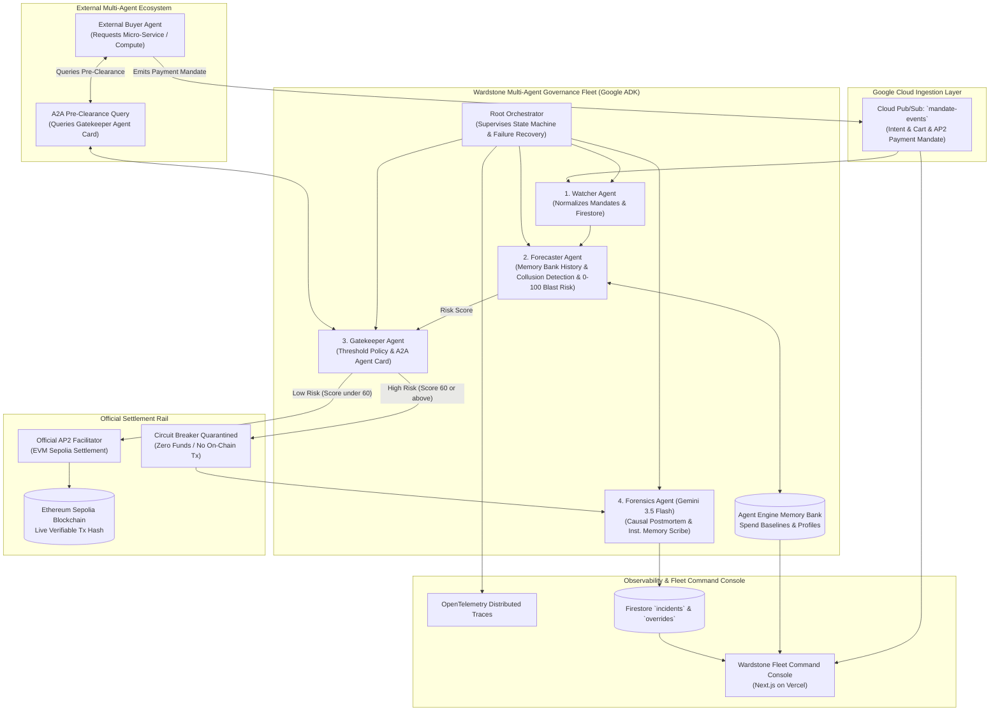

# Wardstone AP2: Zero-Trust Agent Fleet Gatekeeper

> **Live Dashboard**: [https://wardstone-ap2.vercel.app](https://wardstone-ap2.vercel.app)  
> **Live Backend API (Cloud Run)**: [https://wardstone-ap2-900526798908.us-central1.run.app/api/v1/health](https://wardstone-ap2-900526798908.us-central1.run.app/api/v1/health)  
> **Verified On-Chain Tx**: [Etherscan Tx `0x07e58acc...`](https://sepolia.etherscan.io/tx/0x07e58acc8c57fd85759b7a770f198e5b8874cda85a8fb658fae0ec0d94886e10)

---

## 1. The Unlikely Hero & Problem Statement

### The Persona: **The AI Agent Fleet Controller**
In the emerging agentic economy, autonomous AI agents procure compute, hire sub-agents, and execute micro-transactions without human supervision using **Google & Coinbase's AP2 / on-chain micropayment protocol**. 

However, organizations face a critical operational nightmare:
* **Runaway Spend Loops**: An unsupervised agent encountering an unhandled prompt loop can burn hundreds of dollars in micro-transactions within minutes.
* **Cross-Agent Sybil Collusion**: Multiple rogue agents can smurf funds into a single destination wallet, bypassing standard per-agent limits.
* **Lack of Predictive Interventions**: Existing API gateways only enforce *static post-facto spend caps* or log traces after money has already left the wallet.

**Wardstone AP2** is the active control plane built for the **AI Agent Fleet Controller** — an autonomous multi-agent governance system that predicts blast-radius risk, detects cross-agent collusion, auto-approves safe payments, quarantines rogue mandates before settlement, and generates plain-English incident postmortems using Gemini 3.5 Flash with an integrated institutional memory feedback loop.

---

## 2. Multi-Agent Nexus Architecture

Wardstone implements the **Multi-Agent Nexus** orchestration pattern using Google ADK with strictly enforced separation of concerns:



---

## 3. Key Differentiators & Advanced Capabilities

### A. Cross-Agent Collusion Detection
Standard velocity checks fail when multiple "distinct" agents sybil-attack or smurf funds into a single destination. Our **Forecaster Agent** utilizes a destination burst tracker to detect multi-agent convergence, immediately flooring the risk score to quarantine the transactions.

### B. Institutional Memory Feedback Loop
When a mandate is quarantined, the **Forensics Agent** queries past human overrides (`FORCE_APPROVE` or `CONFIRM_BAN`) from Firestore. It natively injects this historical context into Gemini 3.5 Flash, allowing the LLM to learn from the Fleet Controller's past decisions when generating explanations for future anomalies.

### C. Hash-Chained Proof of Governance
To ensure that AI governance decisions are untampered, every forensic incident report generates a cryptographic SHA-256 hash that links back to the prior incident's hash. This creates a verifiable governance chain that auditors can recompute at any time to prove zero tampering.

### D. Policy Simulation Engine
Before modifying risk thresholds in production, Fleet Controllers can use the Wardstone dashboard's "Simulate Policy" feature. This engine backtests hypothetical thresholds (e.g., changing the trigger from 60 to 50) against historical mandates, showing the exact diff of how many additional transactions would have been caught or incorrectly blocked.

---

## 4. Strict Separation of Concerns (4 Google ADK Agents)

| Agent | Core Responsibility | What It Does NOT Do |
| :--- | :--- | :--- |
| **1. Watcher Agent** | Subscribes to Pub/Sub events, parses AP2 schemas, normalizes records into Firestore. | Does *not* calculate risk scores, does *not* execute payments. |
| **2. Forecaster Agent** | Queries **Agent Engine Memory Bank**, tracks destination bursts, calculates velocity variance & deviation, outputs 0-100 Blast Risk. | Does *not* make binary approve/deny policy decisions. |
| **3. Gatekeeper Agent** | Applies threshold policy (`Score < 60`), authorizes on-chain EVM Sepolia settlement, or trips Circuit Breaker. Exposes **A2A Agent Card**. | Does *not* generate long-form forensic reports. |
| **4. Forensics Agent** | Ingests quarantined mandates and prompts **Gemini 3.5 Flash** (with Institutional Memory context) to draft executive-ready incident postmortems. | Never touches money or settlement credentials. |

---

## 5. Failure-Tolerant Recovery (Multi-Agent Nexus Rubric)

A key requirement of the hackathon's Multi-Agent Nexus architecture is failure recovery:
* If a worker agent (such as the Forecaster) times out, encounters a network glitch, or returns malformed output, the **Root Orchestrator** catches the exception.
* It performs exponential retries and engages safe **defensive fallback routing** (quarantining unverified high-value transactions defensively) without crashing the fleet or stalling downstream operations.

---

## 6. Live Demo Scenarios & Testnet Disclosure

> [!NOTE]
> **Testnet Disclosure**: All on-chain settlement demonstrations execute strictly on **Ethereum Sepolia Testnet (Chain ID: 11155111)** using test-ETH micropayments. No real currency is transferred.

The built-in Command Console includes triggers to demonstrate the entire lifecycle live:
1. **Clean Micro-Settlement ($2.50)**: Normal steady indexer mandate -> Score: 20.0/100 -> Approved -> Settled on Ethereum Sepolia with verifiable transaction hash.
2. **Batch Compute Mandate ($25.00)**: Nightly batch worker -> Score: 38.5/100 -> Approved -> Settled on Ethereum Sepolia.
3. **Rogue Runaway Loop ($220.00)**: Compromised agent attempting recursive bursts -> Score: 99.0/100 -> **Circuit Breaker Quarantined (Zero On-Chain Movement)** -> Gemini 3.5 Flash generates incident postmortem in Firestore.
4. **Failure Injection & Recovery**: Deliberately crashes the Forecaster mid-flight -> Orchestrator catches error, logs warning, engages defensive quarantine, and keeps the fleet fully operational.

---

## 7. Quick Start & Reproducible Setup Guide

### Prerequisites
* Node.js 18+ (for frontend)
* Python 3.12+ (for backend)
* Google Cloud account with Gemini API key (optional for local deterministic fallback)
* Ethereum Sepolia testnet RPC connection

### Local Installation & Spin-Up

```bash
# 1. Clone the repository
git clone https://github.com/AmanM006/wardstone.git
cd wardstone

# 2. Start the Backend API (FastAPI)
python -m venv venv
source venv/bin/activate
pip install -r requirements.txt
cp .env.example .env
uvicorn src.server:app --host 0.0.0.0 --port 8080

# 3. Start the Frontend Dashboard (Next.js)
cd frontend
npm install
npm run dev
```

Open your browser at **`http://localhost:3000`** to view the live Command Console!

---

## 8. Technology Stack Summary

* **Core AI Reasoning**: Google Gemini 3.5 Flash (via Google GenAI SDK)
* **Edge Pre-Screening**: Semantic Gemini Firewall (Guardrails against prompt injection and jailbreaks)
* **Agent Framework**: Google Agent Development Kit (ADK 2.7)
* **Agent Protocol**: A2A (Agent-to-Agent v1.0) with JSON-LD Agent Cards & AP2 / on-chain micropayments
* **Cloud Infrastructure**: Google Cloud Run, Google Cloud Firestore, Google Cloud Pub/Sub
* **Blockchain Settlement**: Ethereum Sepolia Testnet (Chain ID: 11155111), Web3.py
* **Frontend**: Next.js 16 + TypeScript, deployed to Vercel
* **Backend**: FastAPI, Uvicorn (Python)
* **Observability**: OpenTelemetry Distributed Tracing (OTLP)
