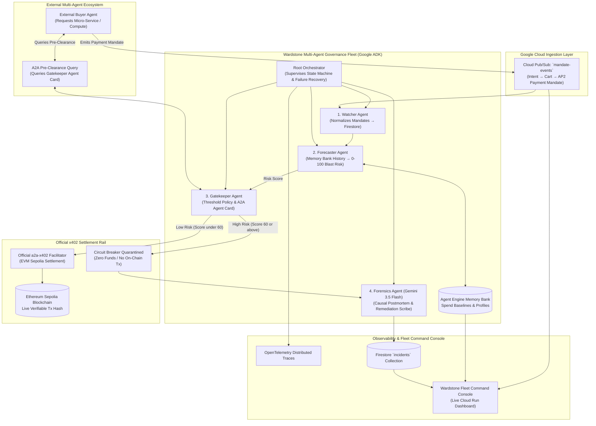

# Wardstone AP2: Circuit Breaker for the Agent Economy

**An autonomous multi-agent governance platform and predictive circuit breaker for the Google & Coinbase AP2 / x402 Agent Payments Protocol, built on Google Cloud, Google ADK, Ethereum Sepolia testnet, and Gemini 3.5 Flash.**

[](https://wardstone-ap2-900526798908.us-central1.run.app)
[](https://sepolia.etherscan.io/tx/0x07e58acc8c57fd85759b7a770f198e5b8874cda85a8fb658fae0ec0d94886e10)
[](https://ai.google.dev/)
[](LICENSE)
[](KNOWN_ISSUES.md)

📚 **Documentation Links:**
- [Known Issues & Historical Bugs](./KNOWN_ISSUES.md)
- [Competitor Intelligence Dossier](./COMPETITOR_INTELLIGENCE_DOSSIER.md)

🏆 **Hackathon Details:**
- **Hackathon:** All Things Agentic Hackathon
- **Submission Category:** Fortified Enterprise Fleet
- **Project Start Date:** August 18, 2026

### 🌐 Live Production Links:
* **Google Cloud Run Backend**: [https://wardstone-ap2-900526798908.us-central1.run.app](https://wardstone-ap2-900526798908.us-central1.run.app)
* **Live Health Check**: [https://wardstone-ap2-900526798908.us-central1.run.app/api/v1/health](https://wardstone-ap2-900526798908.us-central1.run.app/api/v1/health)
* **Verified On-Chain Tx**: [Etherscan Tx `0x07e58acc...`](https://sepolia.etherscan.io/tx/0x07e58acc8c57fd85759b7a770f198e5b8874cda85a8fb658fae0ec0d94886e10)

---

## 1. The Unlikely Hero & Problem Statement

### The Persona: **The AI Agent Fleet Controller**
In the emerging agentic economy, autonomous AI agents procure compute, hire sub-agents, and execute micro-transactions without human supervision using **Google & Coinbase's AP2 / x402 protocol**. 

However, organizations face a critical operational nightmare:
* **Runaway Spend Loops**: An unsupervised agent encountering an unhandled prompt loop can burn hundreds of dollars in micro-transactions within minutes.
* **Lack of Predictive Interventions**: Existing API gateways only enforce *static post-facto spend caps* or log traces after money has already left the wallet.
* **The Blast-Radius Risk**: Before Wardstone, there was no pre-settlement immune system capable of calculating risk velocity and halting anomalous payment mandates *before* on-chain finality.

**Wardstone AP2** is the active control plane built for the **AI Agent Fleet Controller** — an autonomous multi-agent governance system that predicts blast-radius risk, auto-approves safe payments, quarantines rogue mandates before settlement, and generates plain-English incident postmortems using Gemini 3.5 Flash.

---

## 2. Multi-Agent Nexus Architecture

Wardstone implements the **Multi-Agent Nexus** orchestration pattern using Google ADK with strictly enforced separation of concerns:



---

## 3. Strict Separation of Concerns (4 Google ADK Agents)

| Agent | Core Responsibility | What It Does NOT Do |
| :--- | :--- | :--- |
| **1. Watcher Agent** | Subscribes to Pub/Sub events, parses AP2 schemas, normalizes records into Firestore. | Does *not* calculate risk scores, does *not* execute payments. |
| **2. Forecaster Agent** | Queries **Agent Engine Memory Bank**, calculates velocity variance & deviation, outputs 0–100 Blast Risk. | Does *not* make binary approve/deny policy decisions. |
| **3. Gatekeeper Agent** | Applies threshold policy (`Score < 60`), authorizes on-chain EVM Sepolia settlement, or trips Circuit Breaker. Exposes **A2A Agent Card**. | Does *not* generate long-form forensic reports. |
| **4. Forensics Agent** | Ingests quarantined mandates and prompts **Gemini 3.5 Flash** to draft executive-ready, plain-English incident postmortems. | Never touches money or settlement credentials. |

---

## 4. Failure-Tolerant Recovery (Multi-Agent Nexus Rubric)

A key requirement of the hackathon's Multi-Agent Nexus architecture is failure recovery:
* If a worker agent (such as the Forecaster) times out, encounters a network glitch, or returns malformed output, the **RecoveryManager** catches the exception.
* It performs exponential retries and engages safe **defensive fallback routing** (quarantining unverified high-value transactions defensively) without crashing the fleet or stalling downstream operations.

---

## 5. Live Demo Scenarios & Testnet Disclosure

> [!NOTE]
> **Testnet Disclosure**: All on-chain settlement demonstrations execute strictly on **Ethereum Sepolia Testnet (Chain ID: 11155111)** using test-ETH micropayments. No real currency is transferred.

The built-in Command Console includes triggers to demonstrate the entire lifecycle live:
1. **Clean Micro-Settlement ($2.50)**: Normal steady indexer mandate $\rightarrow$ Score: 20.0/100 $\rightarrow$ Approved $\rightarrow$ Settled on Ethereum Sepolia with verifiable transaction hash.
2. **Batch Compute Mandate ($25.00)**: Nightly batch worker $\rightarrow$ Score: 38.5/100 $\rightarrow$ Approved $\rightarrow$ Settled on Ethereum Sepolia.
3. **Rogue Runaway Loop ($220.00)**: Compromised agent attempting recursive bursts $\rightarrow$ Score: 99.0/100 $\rightarrow$ **Circuit Breaker Quarantined (Zero On-Chain Movement)** $\rightarrow$ Gemini 3.5 Flash generates incident postmortem in Firestore.
4. **Failure Injection & Recovery**: Deliberately crashes the Forecaster mid-flight $\rightarrow$ Orchestrator catches error, logs warning, engages defensive quarantine, and keeps the fleet fully operational.

---

## 6. Quick Start & Reproducible Setup Guide

### Prerequisites
* Python 3.12+
* Google Cloud account with Gemini API key (optional for local deterministic fallback)
* Ethereum Sepolia testnet RPC connection (defaults to `https://ethereum-sepolia-rpc.publicnode.com`)

### Local Installation & Spin-Up

```bash
# 1. Clone the repository
git clone https://github.com/AmanM006/wardstone.git
cd wardstone

# 2. Install dependencies with pip
pip install -r requirements.txt

# 3. Configure environment variables
cp .env.example .env

# 4. Launch the FastAPI server and Command Console
uvicorn src.server:app --host 0.0.0.0 --port 8080
```

Open your browser at **`http://localhost:8080`** to view the live Command Console!

---

## 7. Google Cloud Run Deployment

To deploy Wardstone AP2 to Google Cloud Run:

```bash
# Deploy to Cloud Run directly from source
gcloud run deploy wardstone-ap2 \
  --source . \
  --platform managed \
  --region us-central1 \
  --allow-unauthenticated \
  --set-env-vars GOOGLE_CLOUD_PROJECT=$GOOGLE_CLOUD_PROJECT,GEMINI_MODEL=gemini-3.5-flash,BASE_SEPOLIA_RPC_URL=https://ethereum-sepolia-rpc.publicnode.com
```

---

## 8. Technology Stack Summary

* **Core AI Reasoning**: Google Gemini 3.5 Flash (via Google GenAI SDK)
* **Edge Pre-Screening**: Semantic Gemini Firewall (Guardrails against prompt injection and jailbreaks)
* **Agent Framework**: Google Agent Development Kit (ADK 2.7)
* **Agent Protocol**: A2A (Agent-to-Agent v1.0) with JSON-LD Agent Cards & AP2 / x402 micropayments
* **Cloud Infrastructure**: Google Cloud Run, Google Cloud Firestore, Google Cloud Pub/Sub
* **Blockchain Settlement**: Ethereum Sepolia Testnet (Chain ID: 11155111), Web3.py
* **Observability**: OpenTelemetry Distributed Tracing (OTLP)
* **Backend & UI**: FastAPI, Uvicorn, Next.js 16 + TypeScript Dashboard
